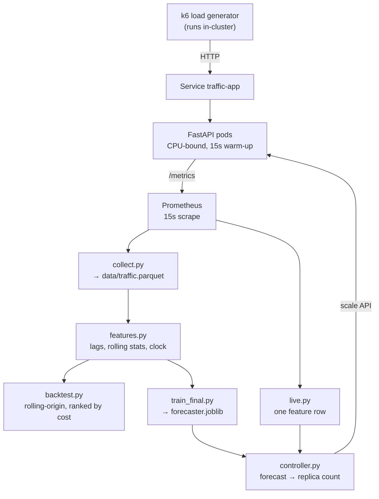

# Predictive Autoscaling for Kubernetes

Forecast a service's request rate 60 seconds ahead and scale the deployment before
the traffic arrives — then measure whether it actually helps, against stock HPA
under identical load.

**Result: p99 latency 62% lower than Kubernetes' built-in autoscaler, for 28% more
pod-seconds** — three runs per arm, identical traffic. That is on a load ramp the model
can anticipate. On an instantaneous spike it cannot, and it ties. Both results are below;
the second one is the more interesting of the two.


The lower panel is the mechanism. The predictive controller adds pods across
minutes 5–10 while load is still climbing. The HPA holds at 2 pods for that entire
stretch and reaches 3 only at minute 10 — after the plateau has arrived. The upper
panel is the consequence: the baseline's p99 peaks at 620 ms exactly when it
finally reacts.

## The problem

Kubernetes' HorizontalPodAutoscaler is reactive: it adds pods only *after* CPU has
already risen. On this cluster a new pod takes **19 seconds** to go from created to
Ready (measured over three pod deletions: 19 s, 19 s, 18 s — dominated by the app's
deliberate 15-second warm-up). So every traffic ramp is served by an under-scaled
service for as long as it takes the HPA to notice plus the time for pods to boot.

There is a second, subtler failure. The HPA scales on CPU as a percentage of the
pod's CPU *request*. Once a pod saturates its limit, utilisation reads 100% and
cannot go higher — a pod at 3x overload is indistinguishable from one at 1.01x. The
HPA can therefore only grow the replica count by `100/target` per cycle, so it
creeps rather than jumps. Measured during a 4x step: it reached 4 of the ~7 pods
needed and stopped.

## Architecture



`features.py:build_table` is called by **both** the training path and the inference
path. That shared call is the design's load-bearing element: if the two ever built
features differently, the model would be silently asked a different question at
serve time than it learned. Two such bugs were found and fixed during development —
see Limitations.

## Results

### The forecast

Rolling-origin backtest, 4 folds, 12,277 rows (51 hours of collected traffic).
Ranked by **cost**, defined as `10 × under-provisioning + 1 × over-provisioning`,
because being short of capacity costs user-visible latency while being long costs a
little compute.

| model | MAE | MAE sd | under | over | cost | vs naive |
|---|---|---|---|---|---|---|
| **gbm_q0.90** | 4.77 | 0.34 | 223 | 2068 | **4,295** | **64.5% lower** |
| gbm (mean) | 2.24 | 0.24 | 507 | 566 | 5,636 | 53.4% lower |
| naive | 4.65 | 0.19 | 1096 | 1136 | 12,094 | — |
| moving avg (3 min) | 6.92 | 0.45 | 1625 | 1696 | 17,944 | 48.4% worse |
| seasonal naive | 9.87 | 1.15 | 2291 | 2448 | 25,359 | 110% worse |

The most instructive row is the second. **The mean-targeting GBM has less than half
the MAE of the winner and costs 31% more.** Targeting the 90th percentile cuts
under-provisioning from 507 to 223 and pays for it with surplus capacity worth a
tenth as much per unit. A model selected on MAE would have picked the wrong one.

Seasonal naive finishes last because the synthetic traffic places 2–3 spikes at
*random* minutes each cycle, so "same time yesterday" imports yesterday's spike into
today. That is a fact about the data, and worth stating rather than hiding.

### The benchmark

Identical 20-minute k6 scenario, zero randomness, three runs per arm. Load is
offered at a fixed *arrival rate* rather than by virtual users, so both arms are
given exactly the same work — with closed-loop VUs the better-scaling arm would
serve more requests and the latency comparison would be between different workloads.

**Ramp scenario** — 20 → 80 req/s over 6 minutes, hold, ramp down:

| arm | p50 | p95 | **p99** | max | pod-seconds | failed |
|---|---|---|---|---|---|---|
| Baseline (HPA) | 73 ms | 279 ms | **479 ms** | 1021 ms | 3,053 | 0.00% |
| Predictive | 51 ms | 132 ms | **183 ms** | 385 ms | 3,907 | 0.00% |

Per-run p99 — baseline 473 / 561 / 404 ms; predictive 175 / 186 / 188 ms. The
predictive arm is tighter as well as lower, which is what distinguishes a policy
difference from luck.

**Step scenario** — instantaneous 4x jump, no precursor:

| arm | runs | p99 | pods reached |
|---|---|---|---|
| Baseline (HPA) | 3 | 467 ms | 3 |
| Predictive | 1 | 522 ms | 5 |

**No advantage.** The predictive arm here is a *single* run, not three — once the
ramp scenario showed where the real difference lay, the remaining budget went there.
Treat the step figure as indicative rather than as a measured result. A forecaster reading lag features has nothing to forecast from
until the step has already happened; both policies are blind for the first 30–60
seconds and pods take 19 s regardless. The controller provisioned *correctly* — 5
pods against the HPA's 3 — and still did not win, because the queue had already
formed. This is why production systems run predictive scaling *alongside* reactive
policies rather than instead of them.

## Reproducing

Prerequisites: Docker, `kind`, `kubectl`, `helm`, `k6`, and a Python venv from
`requirements.txt`. Two port-forwards are assumed throughout (`make forward-app`,
`make forward-prom`).

```bash
# 1. cluster + app
kind create cluster --name autoscale
make build && make load && make deploy

# 2. monitoring (kube-prometheus-stack, 15s scrape) and metrics-server

# 3. collect traffic history — leave running for 2+ days
make load-start
while true; do python collect.py; sleep 600; done

# 4. measure the two numbers that must never be guessed
kubectl delete -f k8s/hpa.yaml
kubectl scale deploy/traffic-app --replicas=1
make capacity                        # one pod's req/s at flat p95

# 5. evaluate and train
python src/backtest.py               # → outputs/results.csv, forecast.png
python src/train_final.py            # → models/forecaster.joblib
python src/predictor.py              # dry run: prints forecasts, changes nothing

# 6. benchmark, 3 runs per arm
make load-stop
kubectl apply -f k8s/hpa.yaml
make bench RUN=A1r SCRIPT=ramp.js    # ... A2r, A3r

kubectl delete -f k8s/hpa.yaml
CAPACITY_PER_POD=20 python src/controller.py &
make bench RUN=B1r SCRIPT=ramp.js    # ... B2r, B3r

python analyze.py                    # → results-r.md, outputs/comparison-r.png
```

## Limitations

**The traffic is synthetic.** A scripted diurnal cycle with random spikes, not a
real production workload. The shape is learnable by construction; real traffic
carries structure this model has never been tested against.

**Spikes without leading indicators cannot be predicted.** Quantified above: the
model ties on an instantaneous step. The controller declines to act on unusable
input (no data, non-finite forecast, or a forecast more than 10x the recent max) and
logs a hold, leaving reactive scaling as the net underneath.

**One service, laptop scale.** A single deployment on a 10-core kind cluster,
2–20 pods. Nothing here has been tested with multiple services competing for nodes,
or where scheduling latency rather than pod boot time dominates.

**28% more compute.** The latency win is not free. Whether that trade is worth
making depends on the relative cost of latency and compute for the service in
question — which is exactly the `10:1` ratio the model's quantile encodes, and it is
an assumption, not a measurement.

**Two train/serve bugs were found by running the system, not by reading it.** The
inference path was not putting Prometheus data on the same 15-second grid the
training path uses, so every lag pointed at the wrong moment; and the cycle-position
features were anchored to the first row of the input frame, which is fixed in
training but slides at inference — leaving them frozen at a constant during serving.
Both produced *plausible* forecasts, roughly 45% too high, with no error anywhere.
The backtest cannot catch this class of bug, because the backtest only ever exercises
the training path.

## Stack

Python 3.14 · LightGBM (quantile objective) · pandas · pyarrow · FastAPI ·
Kubernetes (kind) · Prometheus + kube-state-metrics · k6 · Docker

`models.py` carries an untested scikit-learn fallback for environments without a
LightGBM wheel; every number here was produced by LightGBM.

Full design notes, including the decisions that were deliberately not revisited,
are in [CLAUDE.md](CLAUDE.md).
